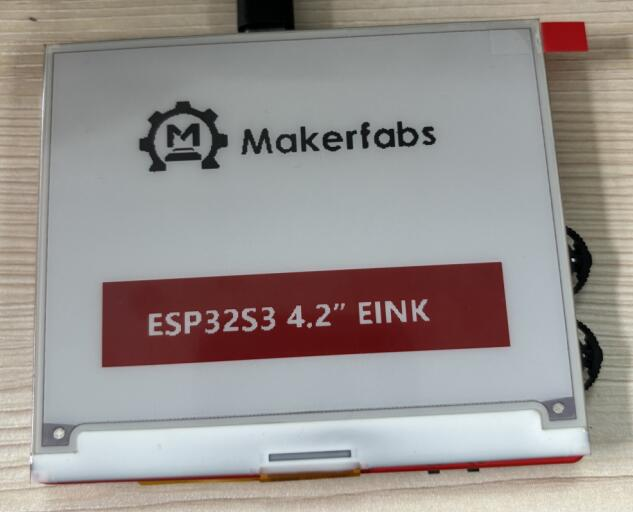

# ESP32 S3 4.2" EINK


```

Version:    V1.0
Author:     Vincent
Create Date:    2024/3/25
Note:


```



[toc]

# Makerfabs

[Makerfabs home page](https://www.makerfabs.com/)

[Makerfabs Wiki](https://wiki.makerfabs.com/)


# ESP32 S3 4.2" EINK
## Intruduce

Product Link ：[]() 

Wiki Link : []()

The red and black ink screen uses the ESP32S3 driver, contains an SD card slot and two three-way toggle switches.


## Feature

- Integrated ESP32 S3 2.4G WiFi and Bluetooth
- Input Voltage: 3.7V Battery or 5.0V Type-C
- Resolution: 400 * 300
- Display Color: Red / Black and White

# Code

## Compiler Options

- Use type-c use cable connect USB-TTL to PC.
- Select "ESP32 S3 DEV Module"

Libraries:
- Use 2.0.0   FS
- Use 2.0.0   Wire
- Use 1.0.0   esp32-waveshare-epd
- Use 2.0.0   SD_MMC

We used the ink screen driver provided by Waveshare and modified the pins to fit our hardware.


## Example

### fw_test

Factory firmware.
Refresh the solid color page, display the makerfabs Logo, display simple text and multi-color test, and display TF card capacity, press any key to sleep the screen.

### ebook

Read txt file in tf cards, and use switch to change page.

### pic_display

A bmp picture, binary processing, display on the screen.

